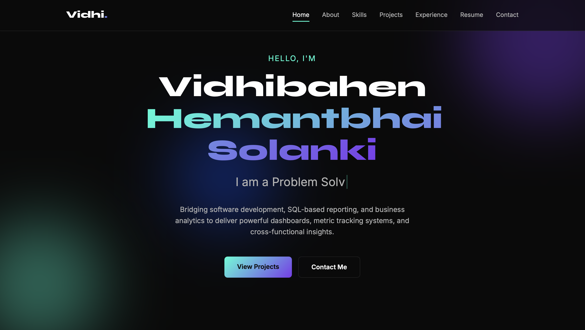

# 📊 EXECUTIVE SUMMARY: Vidhi Solanki Portfolio

> **Mission:** Transforming complex datasets and raw code into actionable, elegant web experiences.

Welcome to the source repository of my personal portfolio. This project serves as a live, interactive dashboard of my professional journey, bridging the gap between Data Analytics, Business Intelligence, and Software Development.



## 📈 Key Portfolio Indicators (KPIs)

| Metric | Value | Description |
| :--- | :--- | :--- |
| **Performance** | Maximum | Zero external libraries or frameworks used. 100% pure vanilla tech. |
| **Architecture** | Glassmorphism | Modern, luxury UI with deep dark-mode aesthetics and fluid gradients. |
| **Interactivity** | High | Custom scroll reveals, typing effects, and DOM observers. |
| **Accessibility** | Built-in | Fully responsive across mobile, tablet, and desktop viewports. |

## 🛠️ System Architecture (Tech Stack)

**`[ FRONTEND CORE ]`**
- `HTML5` - Semantic structural foundation and embedded document viewing.
- `CSS3` - Advanced styling, grid layouts, CSS variables, and keyframe animations.
- `Vanilla JS` - State management, event listeners, and Intersection Observers.

## 📂 Directory Tree

```text
ROOT/
├── index.html       # The View Layer
├── style.css        # The Presentation Layer
├── script.js        # The Logic Layer
├── resume.pdf       # Downloadable Asset
└── README.md        # System Documentation
